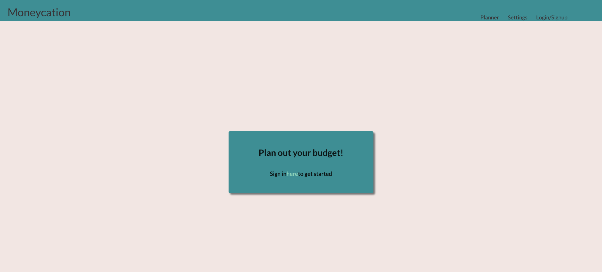
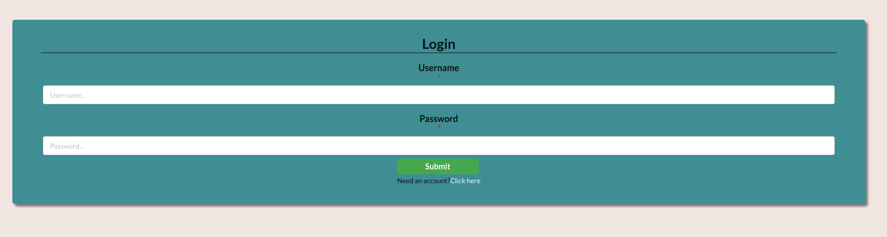
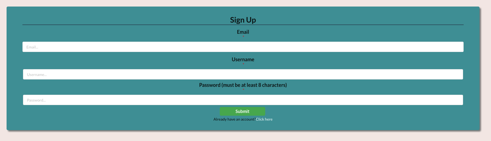
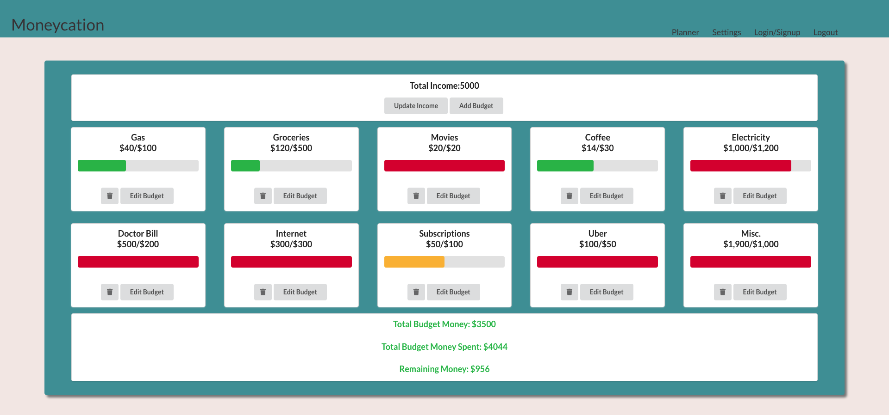
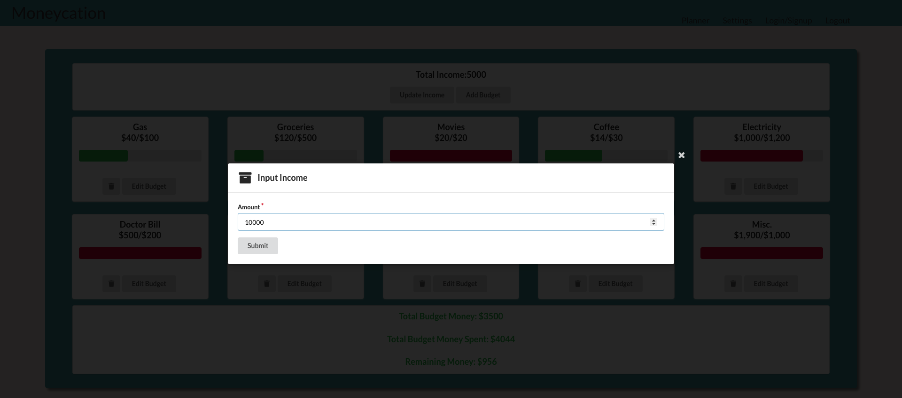
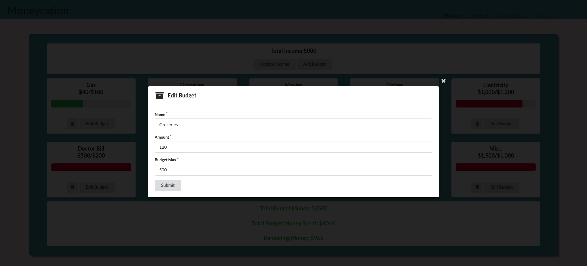
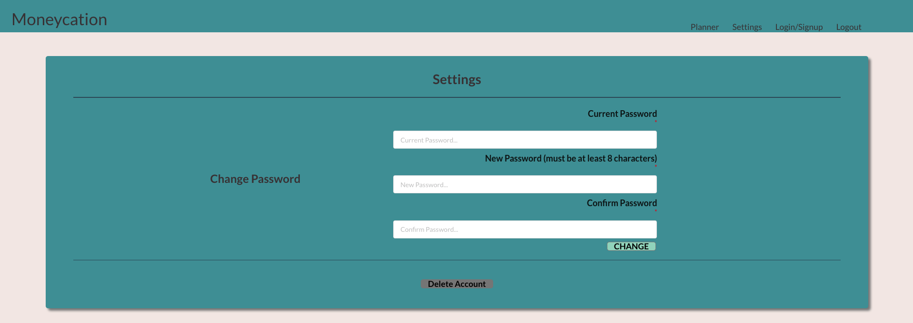
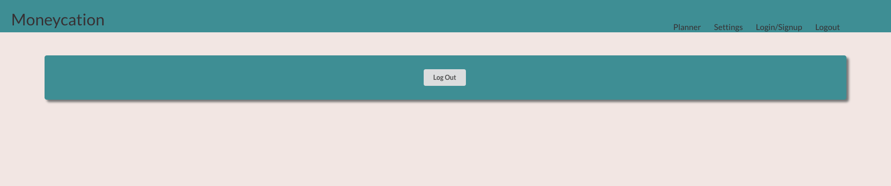

## Welcome to the Moneycation wiki!

Moneycation is a react app that acts as a simple and straightforward budget planner that will be used for personal reasons. This app would take inspiration from the traditional money envelope way of budget planning.

## Table of Contents
1. [Contact Us](#Contact-Us)
2. [User Guide](#User-Guide)
3. [How to Use](#How-To-Use-Moneycation)
4. [Disclaimers](#Disclaimers)
5. [Release License/Copyright](#Release-License/Copyright)

## Contact Us
ProGrand:
[Darnell Domingo](https://github.com/darneii)
[Katherine Piniol](https://github.com/piniolk)
[Karen Wong](https://github.com/karenwong-kw)

## Sample Video

To see the video, click [here](https://github.com/427-ProGrand/moneycation.github.io/blob/main/images/SampleVideo.mp4) or navigate to the images folder of the moneycation.github.io repository. It's named "SampleVideo.mp4."

## User Guide
### Log In Page

User must log in with their account credentials. If usename is not recognized, user is prompted to create an account. 

### Sign Up Page

User can create an account with their email, username, and password.
*Password must be 8 characters long to be accepted*.

### Planner Page

Planner page shows the user's income and budgets added. 
The bottom of the page shows the total budget money spent, budget money amount, and remaining money.

User may add and update their income.

User may add, update, and delete different budgets.
Each budget consists of a name, amount, and, max budget.
The bar will be *red* if the budget max is met.
The bar will be *green* if the budget max is far from being met.
The bar will be *yellow* if the budget max is close to being met.

### Account Settings

Once user is logged in, they have the ability to *change account password and delete account*.

### Log Out

User can log out when Moneycation is not in use to close access off from Planner page and Settings page.

### Disclaimers

Using this app requires you to download node, react, and all required packages. All instructions can be found [here.](https://github.com/427-ProGrand/Moneycation/blob/main/README.md)

### Release License/Copyright

[Release Version 1.0.0](https://github.com/427-ProGrand/Moneycation/releases/tag/v1.0.0)
